# Project GLASS: Gateway Liquidation Autonomous Safety Sentinel 🛡️
> **Autonomous, Transparent Liquidation Protection for Perp Traders.**

### 📖 Overview
Project GLASS is a high-autonomy AI agent acting as a **"Perp Safety Copilot"** for professional traders on decentralized perpetual exchanges. Designed to defy the "gravity" of market crashes, GLAS[...]

Instead of acting as a "black box" trading bot, GLASS introduces a **"Glass-Box" transparency model** (Reasoning-Traces as a Product). The agent is accountable for its decisions, emitting verifiabl[...]

### ⚠️ The Problem
1. **Liquidation Cascades:** Traders often face forced liquidations due to extreme leverage (retail averages ~60x). Research shows maintaining a tighter leverage band (3–5x) dramatically reduces[...]
2. **Bridge Latency:** Cross-chain bridging can take hundreds of seconds, making it far too slow to "rescue" a position facing an immediate margin call.
3. **Opaque AI & Blind Copy-Trading:** "Smart copycats" can be profitable, but blindly copying bots without understanding their rationale is dangerous. There is a massive need for transparent, sla[...]

### 💡 The Solution & Architecture
GLASS solves the cross-chain liquidity gap by merging Python-based AI orchestration with the Circle and Arc technology stacks.

#### 1. Agent Layer (Arc Portfolio Sentinel & Perp Safety Copilot)
Built using a `TradingAgents`-style LLM framework, the agent continuously monitors funding rates, volatility, and margin levels. It enforces safe leverage bands and autonomously decides when to de[...]

#### 2. Settlement Layer (Arc Blockchain)
GLASS leverages the **Arc Network**, Circle's EVM-compatible Layer-1 built specifically for stablecoin finance. 
* **Sub-Second Finality:** Arc's Malachite consensus engine delivers deterministic finality in under one second, ensuring rescue transactions settle instantly before a liquidation block hits.
* **USDC Gas Fees:** Arc uses USDC natively, making the agent's rescue budget predictable (~$0.01 per transaction) without exposing it to volatile gas tokens.

#### 3. Interoperability Layer (Arc Cross-Chain Inventory Router)
To achieve "antigravity" rescues, the agent uses **Circle Gateway** and CCTP to access a unified USDC balance. A custom cross-chain inventory router helps pre-position liquidity across EVMs to byp[...]

#### 4. Identity & Transparency Layer (Reasoning-Trace Dashboard)
GLASS is entirely transparent. The agent emits structured JSON "Reasoning-Traces" for every rescue or risk decision. These traces are hashed and stored on an **Attribution Registry on Arc**, creat[...]

#### 5. Risk Layer (Leaderboard Risk Wrapper & Slash-Bonding)
The agent features "Skin in the Game." An on-chain "copy score" registry maintains a USDC performance bond on Arc. If the agent's reasoning diverges from its actions, or if risk metrics breach thr[...]

---

### 🏗️ System Architecture

AGORA-glass utilizes a decoupled architecture where an off-chain Python agent orchestrates risk assessment, while the Arc blockchain provides a trustless settlement layer.

```mermaid
flowchart TD
    subgraph OffChain["Off-Chain Python Agent (Joe)"]
        Monitor["PerpMonitor\n(Fetches live positions)"]
        Engine["RiskEngine\n(Assesses margin & leverage)"]
        Tracer["ReasoningTracer\n(JSON trace + SHA256 hash)"]
        Dispatcher["RescueDispatcher\n(Gateway mock + Vault call)"]
        Bus(("MessageBus"))

        Monitor -->|position_update| Bus
        Engine -->|risk_verdict| Bus
        Tracer -->|reasoning_trace, trace_pinned| Bus
        Dispatcher -->|rescue_initiated, rescue_complete| Bus
        Bus -->|position_update| Engine
        Bus -->|risk_verdict| Tracer
        Bus -->|risk_verdict| Dispatcher
    end

    subgraph OnChain["Arc Testnet (Ayo)"]
        Registry["AttributionRegistry.sol\nstoreReason(bytes32)"]
        Vault["Vault.sol\nUSDC custody, agent-gated rescue"]
    end

    subgraph CircleStack["Circle Financial Stack"]
        Gateway["Circle Gateway (mock)\nsub-500ms cross-chain"]
        Wallets["Dev-Controlled Wallets"]
        AppKit["Circle App Kit (frontend)"]
        CLI["Arc CLI\n(RPC, updates, context)"]
    end

    subgraph Frontend["Frontend Dashboard (Andy)"]
        UI["Next.js + WebSocket\nPosition health, rescue feed"]
    end

    Bus -.->|"WebSocket bridge"| UI
    Tracer -->|store hash tx| Registry
    Dispatcher -->|rescue release| Vault
    Dispatcher -->|initiate transfer| Gateway
    Vault -.->|funds managed by| Wallets
    UI -.->|read events| Registry

    style OffChain fill:#fdfcf0,stroke:#d4a017,stroke-width:2px
    style OnChain fill:#f0f7ff,stroke:#0052ff,stroke-width:2px
    style CircleStack fill:#f5f0ff,stroke:#6700eb,stroke-width:2px
    style Frontend fill:#f9f9f9,stroke:#333,stroke-width:2px
```



---

### 👥 Team Roles & Coordination

| Role | Lead | Primary Responsibilities | Stack |
| :--- | :--- | :--- | :--- |
| **Agent Architect** | **Joe** | PerpMonitor, RiskEngine, ReasoningTracer, MessageBus, WS Bridge. | Python, asyncio, web3.py |
| **On-chain Engineer** | **Ayo** | `AttributionRegistry.sol`, `Vault.sol`, deployment, ABIs. | Solidity, Foundry/Hardhat |
| **Full-stack/UX** | **Andy** | Next.js Dashboard, WS Client, App Kit Integration, Fund Vault UI. | TS, React, viem/ethers |
| **DevRel / Narrator** | **Lani** | Storytelling, Pitch, Traction updates, User onboarding, Demo. | Arc CLI, Storytelling |

---

### 📅 Build Flow (2-Week Sprint)

#### Week 1: Core Loop & Contracts
| Day | Joe (Agent) | Ayo (On-chain) | Andy (Frontend) | Lani (DevRel) |
|:---|:---|:---|:---|:---|
| **D1** | Scaffold MessageBus & Monitor | Deploy `AttributionRegistry` | Scaffold Next.js & Wallet Connect | `update product`, Storyboard |
| **D2** | Hyperliquid Data Integration | Deploy `Vault` (Agent-Gated) | Build Health Cards (Mock Data) | Pitch structure, Teaser video |
| **D3** | RiskEngine & ReasoningTracer | Wire Vault Auth to Joe's Addr | Build "Reasoning Trace" Feed | Community feedback, Discord |
| **D4** | RescueDispatcher (Mock GW) | Verify Contracts on Arcscan | WebSocket Live Connection | Live-demo script, Fail-over plan |
| **D5** | Integration: Real Arc Txns | Finalize ABIs & Event Specs | Build "Fund Vault" UI | Rehearse demo, Backup video |
| **D6** | Hardening & Env Config | Code review & Gas report | Polish UI & Responsiveness | Finalize script & Story |
| **D7** | **Integration Milestone** | **Contract Freeze** | **MVP Dashboard Live** | `update traction` (Early metrics) |

#### Week 2: Polish & Traction
- **D8-9:** Optimize scheduling (Joe) / User onboarding flow (Andy) / 3-5 Test Users (Lani).
- **D10:** Real-data dry run (Joe) / "Total Rescued" Tracker (Andy) / 2-min Demo Recording (Lani).
- **D11-14:** Bug fixes, Final Integration, Ship to Luma/Hackathon portal.

---

### 🎯 Hackathon Focus (Agora Agents)
This project directly addresses the following tracks:
* **RFB 01 (Perpetual Futures Trading Agent):** 24/7 monitoring and autonomous liquidation protection.
* **RFB 06 (Social Trading Intelligence):** Providing verifiable "Reasoning-Traces" and slash-bonded copy-trading rather than blind execution.

#### ���� Hackathon Strategy (Agora x Circle)

| Judging Criterion (weight) | How AGORA-glass Scores |
|---------------------------|------------------------|
| **Agentic Sophistication** (30%) | Fully autonomous loop: monitor → assess → decide → execute → log. No human intervention. |
| **Traction** (30%) | Real-world utility for perp traders. Onboarding test users during the hackathon to show live rescues and volume. |
| **Circle Platform Utilization** (20%) | Deep integration: Arc testnet (settlement), Circle Gateway (cross-chain), Dev-Controlled Wallets, and Circle App Kit. |
| **Innovation** (20%) | "Glass-Box" identity—combining verifiable decision-making (RFB 06) with autonomous perp safety (RFB 01). |

---

### 🛠️ Development Tools
This project uses **ARC-cli** (`arc-canteen`) for tracking progress and interacting with the Arc network.
- **Status:** `arc-canteen status`
- **Traction Updates:** `arc-canteen update-traction`
- **Product Updates:** `arc-canteen update-product`
- **Context/Docs:** `arc-canteen context`

See [HACKATHON.md](./HACKATHON.md) for full installation and usage details.

---

### ⚙️ Environment Configuration

```json
{
  "mcpServers": {
    "notebooklm": {
      "command": "npx",
      "args": [
        "-y",
        "@roomi-fields/notebooklm-mcp"
      ]
    }
  }
}
```

---

*Maintained by the AGORA-glass Team.*
