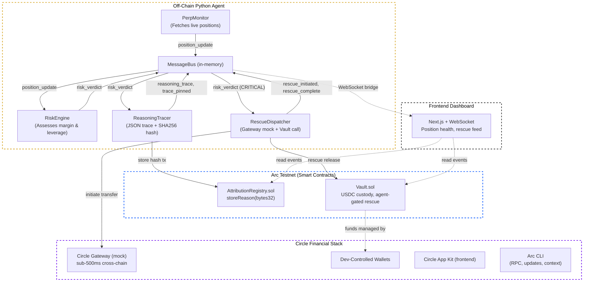

# The Glass‑Box Liquidation Protector – Architecture & Code Outline

## System Overview



### Python monitoring agent (off‑chain)
- Watches perp accounts on Hyperliquid/dYdX via public APIs.
- Computes margin ratio, liquidation price, current leverage.
- Decides: “Safe,” “Warning (add collateral or deleverage),” “Critical (emergency rescue).”
- For every decision, generates a structured JSON reasoning trace exactly like TradingAgents’ Trader agent does (five‑tier rating, evidence bullets).
- If action is “Critical,” triggers a cross‑chain USDC rescue via Circle Gateway + CCTP.

### Arc smart contracts
- **Vault.sol**: holds users' USDC; only the agent (a whitelisted address) can request a withdrawal for rescue. Enforces a time‑lock if desired.
- **AttributionRegistry.sol**: accepts a bytes32 reasonHash + timestamp; simple on‑chain log.
- **(Optional) BondEscrow.sol**: manager stakes USDC; slashable if reasoning traces show the agent violated its own risk rules (e.g., allowed leverage > 5×).

### Circle tools
- **Wallets** (developer‑controlled) for agent operations.
- **Gateway** to unify USDC balance and achieve sub‑500ms cross‑chain transfers.
- **CCTP** to move USDC between Arc and the target chain (e.g., Arbitrum for Hyperliquid deposits).

### Reasoning‑Trace Identity
Every time the agent acts (or even just observes), it publishes a JSON like:

```json
{
  "timestamp": "2026-05-15T14:23:01Z",
  "agent_id": "liquidation_protector_v0.1",
  "action": "rescue_topup",
  "account": "0x...",
  "leverage_before": 4.8,
  "margin_ratio": 0.15,
  "rescue_amount_usdc": 500,
  "evidence": [
    "Funding rate negative for 3 consecutive hours (bearish pressure).",
    "RSI(14) below 30 on 1-hour chart.",
    "Price within 2% of liquidation level."
  ],
  "risk_rating": "CRITICAL",
  "reason_hash": "0xa1b2..."
}
```
The hash of this JSON is pinned on Arc via the registry – immutable, cheap, verifiable.

---

## 2‑Week Sprint Plan (Python‑centered, Solidity‑lite)

### Week 1: Foundations (May 11‑17)
- **Day 1‑2: Set up Arc testnet & Python environment**
  - Install ARC CLI and run a local node.
  - Deploy a minimal Vault contract (fork the escrow template).
  - Deploy AttributionRegistry with `storeReason(bytes32 hash)`.
  - Python: venv, `web3.py`, `requests`, `ccxt` or Hyperliquid SDK.
- **Day 3‑4: Build the Python monitoring skeleton**
  - Fetch Hyperliquid account positions, calculate margin ratio.
  - Implement structured JSON trace generator + SHA256 hashing.
  - Call registry contract to store hash on Arc.
- **Day 5‑6: Implement USDC rescue logic (simulated)**
  - Integrate Circle's Gateway SDK (mock on-chain call for demo).
  - Auto-trigger rescue on CRITICAL state: release funds from Vault to target chain.
- **Day 7: End‑to‑end dry run**
  - Test pipeline with historical or simulated data.
  - **Deliverable**: Working agent with monitoring, tracing, and mock rescue.

### Week 2: Polish & Demo (May 18‑25)
- **Day 8‑9: Real cross‑chain flow with Circle Gateway/CCTP**
  - Move testnet USDC from Arc to destination chain via CCTP.
- **Day 10: Slash‑bonding contract (optional but high‑impact)**
  - Deploy `BondEscrow.sol`. Self-auditing agent calls `slashBond` on violations.
- **Day 11‑12: Frontend dashboard**
  - Next.js page for monitoring, traces, and user vault funding.
- **Day 13: Seed users and traction**
  - Discord/Twitter outreach with live link + testnet faucet.
- **Day 14: Record demo video, submit**
  - Show monitoring, reasoning, rescue, and on-chain verification.

---

## Why this wins
| Criterion | How you meet it |
| :--- | :--- |
| **Agentic Sophistication (30%)** | Autonomous monitoring, risk assessment, and cross‑chain execution; structured decision‑making with evidence. |
| **Traction (30%)** | Real traders can connect their accounts; even a small testnet demo shows clear product‑market fit. |
| **Circle Utilization (20%)** | Deep integration: Arc settlement, USDC vault, Gateway, CCTP, Wallets. |
| **Innovation (20%)** | Combines liquidation protection with verifiable reasoning traces (Glass‑Box). |
