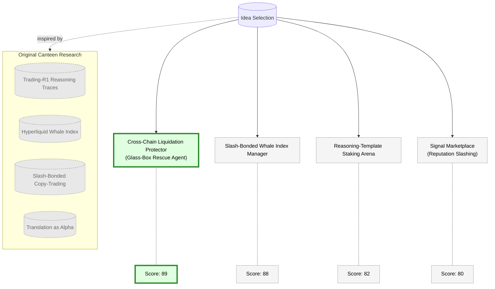
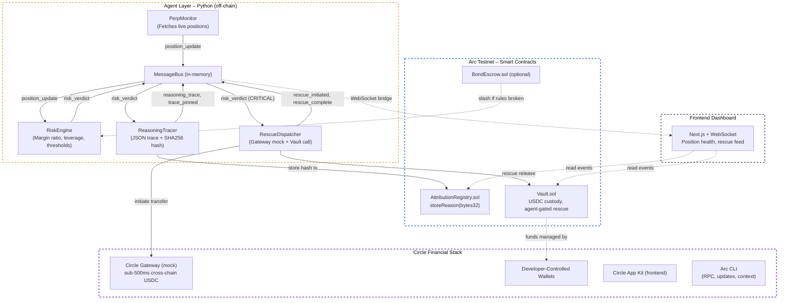
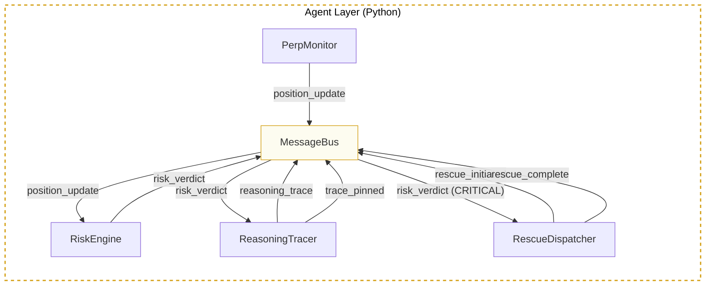
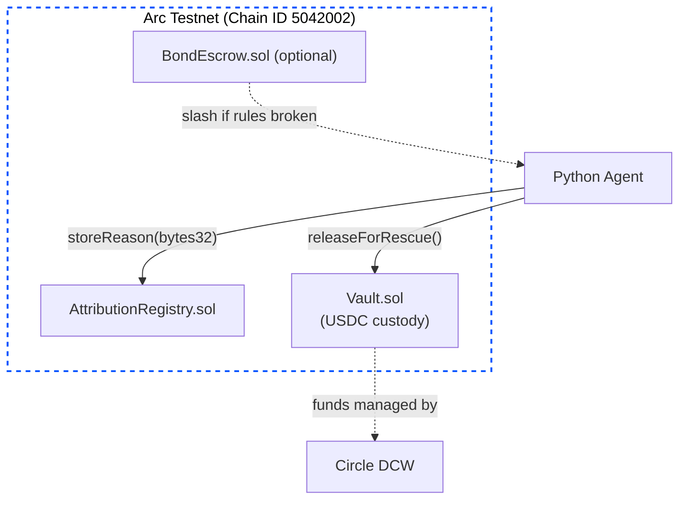
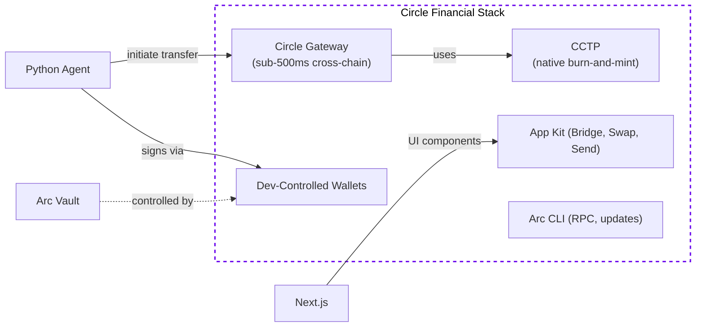
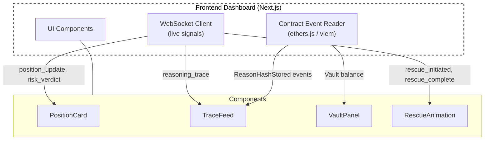
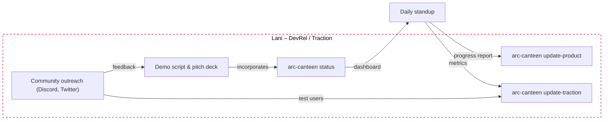

# AGORA-glass: Architectural Diagrams

This document contains the complete suite of architectural diagrams for the AGORA-glass system, detailing the interactions between the Agent Layer, Arc Testnet, Circle Financial Stack, and Frontend Dashboard.

---

### 1. Idea Selection & Scoring  
Shows the four candidate ideas, their inspiration from Canteen’s research, and the final scores that led to our pick.

---

### 2. Full Technical Architecture
The complete high‑level view of all four layers working together.

---

### 3. Agent Layer – Python Module Internals  
How the off‑chain components communicate over the MessageBus.

---

### 4. Arc Layer – On‑Chain Contracts & Identity  
The smart contracts deployed on Arc testnet.

---

### 5. Circle Financial Stack – Gateway, Wallets & App Kit  
How the Circle tools connect the agent to cross‑chain liquidity.

---

### 6. Frontend Dashboard – Data Flow & Components  
How Andy’s dashboard consumes data and interacts with the contracts.

---

### 7. Lani’s DevRel & Traction Workflow  
Lani’s daily loop: updates, community, and demo preparation.

