# AGORA-glass: Knowledge Graph 🕸️

This document maps the relationships between the various control files, documentation, and source code in the AGORA-glass project.

```mermaid
graph TD
    %% Main Entry
    GEMINI[GEMINI.md] --> |Primary Instructions| Rules[.rules/]
    GEMINI --> |Standard Procedures| Workflows[.workflows/]
    GEMINI --> |Domain Expertise| Skills[.skills/]
    GEMINI --> |Technical Specs| Docs[docs/]

    %% Rules Relationships
    subgraph Rules
        GOV[.rules/governance.md]
        ARCH_I[.rules/architecture_improved.md]
        STYLE_I[.rules/code-style_improved.md]
        SEC_I[.rules/testing-security_improved.md]
    end

    %% Workflows Relationships
    subgraph Workflows
        SETUP[.workflows/setup-env_improved.md]
        DEPLOY[.workflows/deploy-contracts_improved.md]
        RUN[.workflows/run-agent_improved.md]
        DRY[.workflows/demo-dry-run_improved.md]
        TRACTION[.workflows/update-traction_improved.md]
    end

    %% Skills Relationships
    subgraph Skills
        PY_S[.skills/python-agent_v3.md]
        SOL_S[.skills/solidity-contracts_improved.md]
        FE_S[.skills/frontend-dashboard_improved.md]
        REL_S[.skills/devrel-traction_improved.md]
    end

    %% Documentation Relationships
    subgraph Docs
        BUILD[docs/BUILD_FRAMEWORK.md]
        DIAG[docs/DIAGRAMS.md]
        SDK[docs/SDK_INTEGRATION.md]
        CLI[docs/ARC_CLI_GUIDE.md]
        GAP[docs/GAP_ANALYSIS.md]
        SYNC[docs/STEALTH_SYNC_GUIDE.md]
    end

    %% Cross-Links
    ARCH_I -.-> BUILD
    PY_S -.-> SDK
    SOL_S -.-> SDK
    FE_S -.-> SDK
    RUN -.-> CLI
    SEC_I -.-> GAP
    SETUP -.-> SYNC

    %% Source Code Mapping
    PY_S --> |Implements| SRC[src/]
    SOL_S --> |Implements| CONT[contracts/]
    FE_S --> |Implements| FRONT[frontend/]
```

## 🔗 Key Connections Explained

1.  **Architecture & Framework:** `architecture_improved.md` enforces the patterns defined in `docs/BUILD_FRAMEWORK.md`.
2.  **SDK Integration:** The `python-agent`, `solidity-contracts`, and `frontend-dashboard` skills all depend on the protocols outlined in `docs/SDK_INTEGRATION.md` (Circle Stack & Arc Stack).
3.  **Autonomous Operations:** The `run-agent` workflow is the practical execution of the `ARC_CLI_GUIDE.md`.
4.  **Security & Gaps:** `testing-security_improved.md` addresses the vulnerabilities and requirements identified in `docs/GAP_ANALYSIS.md`.
5.  **Synchronization:** `setup-env_improved.md` relies on the `STEALTH_SYNC_GUIDE.md` to ensure local environments remain aligned with the blockchain state.

---
*Generated by Antigravity Agent - 2026-05-18*
